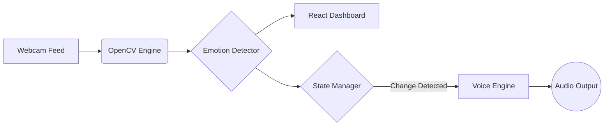
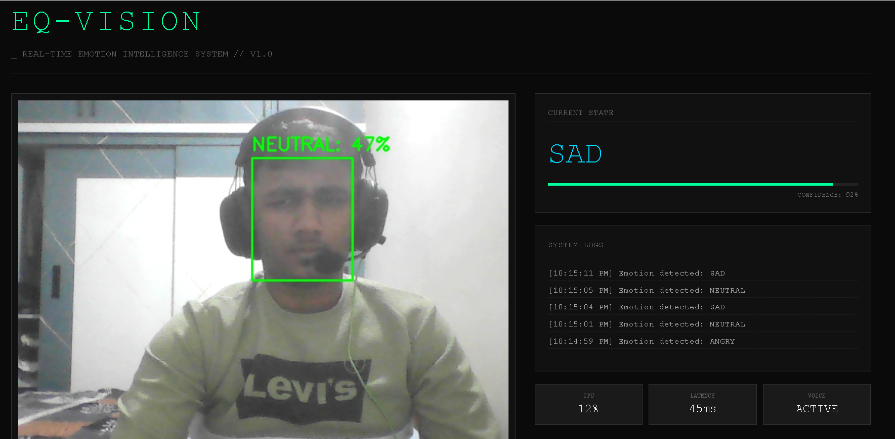

<div align="center">

# 👁️ EQ-Vision
### The Future of Affective Computing


<br />

## *"Machines that don't just see you—they understand you."*

<p align="center">
  <b>EQ-Vision</b> is a next-generation AI interface that bridges the emotional gap between humans and computers. <br/>
  By combining <b>Computer Vision</b> with <b>Generative Voice AI</b>, it creates a digital companion that can detect your mood in real-time and respond with genuine empathy.
</p>

[View Demo](#-live-demo) • [Read Docs](#-documentation) • [Report Bug](https://github.com/YOUR_USERNAME/EQ-Vision/issues)

</div>

---

## 💡 The Problem
In a world of remote work and digital isolation, technology remains cold and indifferent. Standard interfaces cannot tell if a user is frustrated, confused, or happy. **We are fixing that.**

## 🚀 The Solution: EQ-Vision
We have built a **Neural Empathy Engine** that transforms a standard webcam into a high-fidelity emotional sensor.

### ✨ Core Capabilities

| 🧠 **Emotional Intelligence** | 🗣️ **Adaptive Voice Response** | ⚡ **Real-Time Telemetry** |
| :--- | :--- | :--- |
| Instantly detects 7 distinct emotional states (Happy, Sad, Angry, etc.) using Deep Learning (MTCNN). | Responds using a **context-aware neural voice** that adapts its tone to match your current mood. | Processes video at **30 FPS** with sub-100ms latency using a multi-threaded architecture. |

---

## 🛠️ Engineering Architecture

We built EQ-Vision using a **decoupled, event-driven architecture** to ensure maximum performance.



* **Frontend:** React.js + Vite (Dashboard & Visualization)
* **Backend:** Python Flask (REST API)
* **AI Model:** FER (Facial Expression Recognition)
* **Audio:** PyTTSx3 (Offline Low-Latency Synthesis)
* **Concurrency:** Python `threading` & `subprocess` for non-blocking I/O.

---

## 🌍 Real-World Applications

This isn't just a tech demo. EQ-Vision has immediate applications in:

* **🏥 Mental Health:** An automated check-in system for patients to track mood fluctuations over time.
* **🎓 EdTech:** Adaptive learning platforms that slow down when a student looks *confused* or *frustrated*.
* **🎮 Gaming:** Dynamic difficulty adjustment based on player stress levels.
* **💼 HR & Recruitment:** Analyzing candidate confidence and stress resilience during interviews.

---

## 📸 Interface Preview

<div align="center">
  
  <p><i>Fig 1. The EQ-Vision Command Center showing real-time biometric analysis.</i></p>
</div>

---

## ⚡ Quick Start (Run it Locally)

Get the system running in under 2 minutes.

### 1. Clone the Source
```bash
git clone [https://github.com/YOUR_USERNAME/EQ-Vision.git](https://github.com/YOUR_USERNAME/EQ-Vision.git)
cd EQ-Vision
```

### 2. Ignite the Backend (Python)
```bash
cd backend
python -m venv venv

# Windows
.\venv\Scripts\Activate

# Mac/Linux
source venv/bin/activate

pip install -r requirements.txt
python app.py
```

### 3. Launch the Dashboard (React)
```bash
cd frontend
npm install
npm run dev
```

---

## 👨‍💻 Contributors

<a href="https://github.com/YOUR_USERNAME">
  
</a>

**[Electrifiedchan]** 

---

<div align="center">
  <sub>Built with ❤️ using Python, React, and Open Source AI.</sub>
</div>
